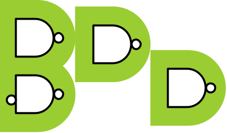

# Bathtub

Bathtub is a free open-source
SystemVerilog package
based on UVM 
that brings Agile Behavior-Driven Development (BDD)
and Gherkin
to the design and verification of integrated circuits,
enabling executable specifications and true living documentation.

This release contains the following:

* `src/`: Bathtub source code
* `docs/`: Files that support Bathtub documentation
* `examples/`: Examples of Bathtub tests and applications

Bathtub is written in SystemVerilog and requires a full-featured SystemVerilog simulator with UVM to run.

For more information and complete documentation, visit:
* [bathtubBDD.dev](https://bathtubbdd.dev)
* [GitHub Repository](https://github.com/williaml33moore/bathtub): Source code repository
* [GitHub Wiki](https://github.com/williaml33moore/bathtub/wiki): Technical documentation and user guides
* [GitHub Discussions](https://github.com/williaml33moore/bathtub/discussions): Join the conversation (requires a free [account](https://github.com/signup?ref_cta=Sign+up&ref_loc=header+logged+out&ref_page=%2F%3Cuser-name%3E%2F%3Crepo-name%3E%2Fdiscussions%2Findex&source=header-repo&source_repo=williaml33moore%2Fbathtub_))
* [GitHub Issues](https://github.com/williaml33moore/bathtub/issues): Task and bug tracking

**B.A.T.H.T.U.B.**: \
**B**DD \
**A**utomated \
**T**ests \
**H**elping \
**T**eams \
**U**nderstand \
**B**ehavior

