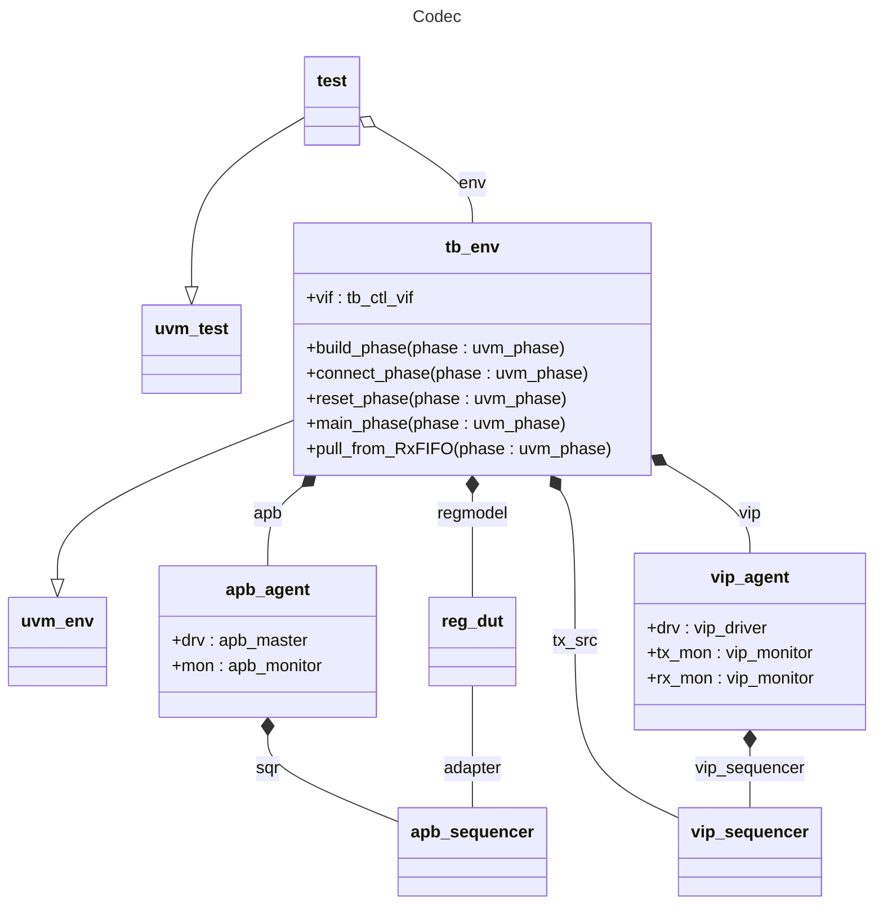

# codec
The reference implementation libraries for UVM 1.0, 1.1, and 1.2 include complete source code for a working verification environment for a simple parallel-to-serial codec.
We are going to apply Bathtub to that codec environment.
The purpose is to illustrate how you can apply Bathtub to any UVM testbench.
## Overview
In general, these are the steps for applying Bathtub to a UVM testbench.
1. Build a working UVM environment.
   * It should follow standard practices and include a top module, DUT, environment (`uvm_env`), and virtual sequencer.
   * You should have the simulators, scripts, and support files required to run the environment.
2. Create a new Bathtub test (`uvm_test`).
   * Instantiate a Bathtub object (`bathtub_pkg::bathtub`) and configure it with your virtual sequencer.
   * Since Bathtub will provide sequences for some of your sequencers, the test should disable any default sequences for run-time phases that might conflict.
3. Write a Gherkin feature file that describes and exercises the behavior of the DUT.
4. Write step definitions (`uvm_sequence`) for every step in the feature file.
5. Run!

This README walks through the above steps for the codec example.
## Build a UVM Environment
Fortunately this has already been done for you.
Download the UVM 1.2 reference implementation class library code ([uvm-1.2.tar.gz](https://accellera.org/images/downloads/standards/uvm/uvm-1.2.tar.gz)) from Accellera's UVM download page, <https://accellera.org/downloads/standards/uvm>.

Often UVM is installed in a central, shared location protected by restricted permissions.
However, for this codec example, you need your own personal UVM installation with full read and write access permissions.
The UVM 1.2 `README.txt` has instructions for installing the kit.
Follow them to unpack the tarball into a "convenient location," perhaps somewhere under your home directory.
```
Installing the kit
------------------

Installation of UVM requires first unpacking the kit in a convenient
location.

    % mkdir path/to/convenient/location
    % cd path/to/convenient/location
    % gunzip -c path/to/UVM/distribution/tar.gz | tar xvf -
```
It is not necessary to set or override the `UVM_HOME` environment variable; the codec scripts take care of that for you.
It doesn't matter if you typically use a UVM version other than 1.2.
The codec example is self-contained and will compile UVM directly from your personal 1.2 installation.

Alternatively, if you already have UVM 1.2 installed somewhere on your file system, you don't need to download it again. You can just copy the entire directory to your personal convenient location with `cp -r`.

You'll be bouncing around a few different directories, so let's give them pseudo variable names to make this discussion easier.
| Name | Description |
| --- | --- |
| `USER_UVM_HOME` | Path to your personal UVM installation. |
| `CODEC_WORKING_DIR` | Path to your codec example. This is your working directory. `CODEC_WORKING_DIR=$USER_UVM_HOME/examples/integrated/codec` |
| `BATHTUB_VIP_DIR` | Path to your Bathtub installation directory. This should be an actual environment variable. |
| `BATHTUB_CODEC_SRC` | Path to the Bathtub codec example source, i.e., the directory containing this `README.md` file. You will copy files from `$BATHTUB_CODEC_SRC` to `$CODEC_WORKING_DIR`. `BATHTUB_CODEC_SRC=$BATHTUB_VIP_DIR/examples/uvm_examples/codec` |

Change to your working directory (`cd $CODEC_WORKING_DIR`) and try to run the codec example as-is.
The directory contains makefiles for the Big Three simulators: Incisive (`ius`), Questa, and VCS.
If you're unfamiliar with makefiles, you can learn about them at <https://www.gnu.org/software/make/>.
Choose your preferred simulator and try running with the corresponding makefile.
| Simulator | Command |
| --- | --- |
| Incisive | `make -f Makefile.ius test` |
| Questa | `make -f Makefile.questa run` # Note that the target is `run`, not `test` like the others. |
| VCS | `make -f Makefile.vcs test` |

Do whatever you need to do to get your simulation to run and pass on your system.
If you look inside the makefiles, you'll see that they each include a corresponding makefile two directories higher (`include ../../Makefile.xxx`), in `$USER_UVM_HOME/examples`.
You may need to set up your environment, or edit the local makefiles in this directory or the included makefiles two directories up.
(They're your personal makefiles, so edit them as much as you like. You might want to make backup copies first.)

Cadence replaced Incisive with Xcelium, so feel free to make a pair of `Makefile.xcelium` files appropriate for the newer simulator, changing "irun" to "xrun," and use those instead.
That's what we've done.
We run Xcelium like so:
`make -f Makefile.xcelium test`

The simulators produce various log files and other artifacts in your working directory.
The included makefiles all have `clean` targets you can use to remove those files.

| Simulator | Command |
| --- | --- |
| Incisive | `make -f Makefile.ius clean` |
| Questa | `make -f Makefile.questa clean` |
| VCS | `make -f Makefile.vcs clean` |

Once your simulation is running and passing, you're ready to move on.

## Create a New Bathtub Test
You got the codec testbench running as-is.
Now we're going to modify it.

`$CODEC_WORKING_DIR/README.txt` briefly describes the DUT, and `$CODEC_WORKING_DIR/block_diagram.pdf` gives an overview of the testbench.
Here's a class diagram of the testbench that focuses on the parts relevant to this Bathtub exercise.

`[](https://mermaid.live/edit#pako:eNqNk81uwyAMx18FcdpXXiCHXTZV2mnSdkVCFJwUCUjKR9Spy7vPIcmSqK1UDsj2_2eb4HCmslFAS1oUBXNRRwMlecOQZC6HpBEhvGtRe2GZI7gihEiK4veVpM7ywZview6uWxR0RiGXICO4iYwJ5zE2rOdOV6QcBBkNR2cl7ZM2ircHEeAh7wgObbL9uAJl4xzIeA_qIcBdoBXa3cO1yRhe-cbyr9PuY_d5k-43d_ZUFMRDzVWKyKJlcQLmAhHtnosa3AChfaF3uuUBjgmcBD_c44kHL69icxm0V1NtUJ3AkvzPb-GvNdn46_EuaesJK99NScrrbs7IEh7XNm5S0dKxWcv-ptyv2y6XdNl20KwIcdN2LJqlK0WXcvME1h8fjhM9T-8KI5Roc0fm6Au14PFnUvji8vEYjQewwGiJpoJKJBMZZa5HVKTYfP84ScvoE7xQ36T6QMtKmIBeapWIML3MEen_AOUQOk8)`


