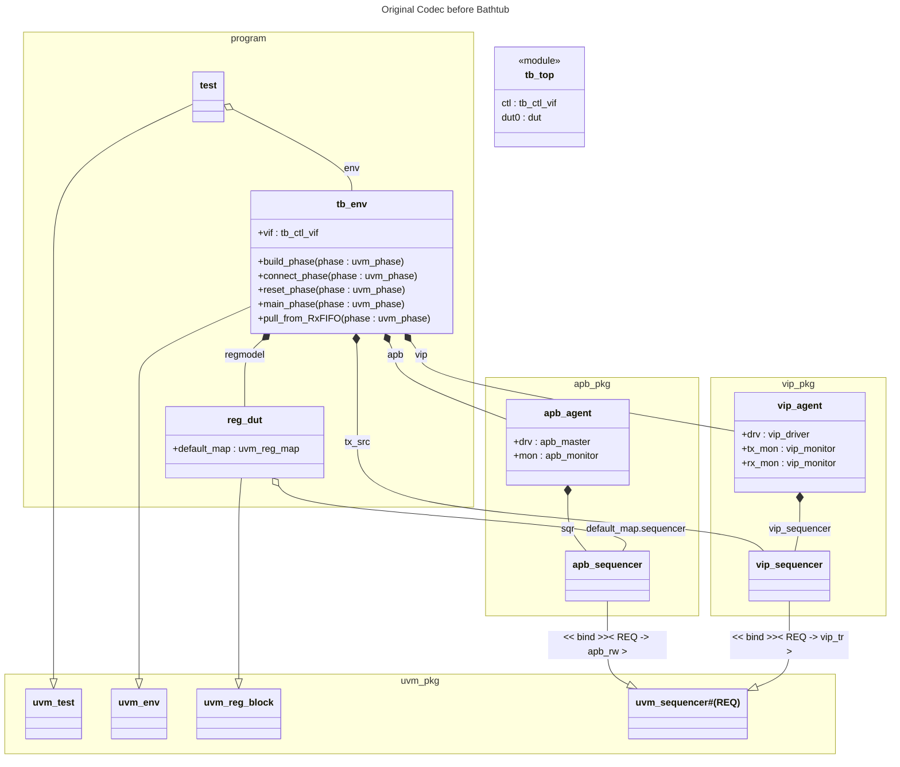
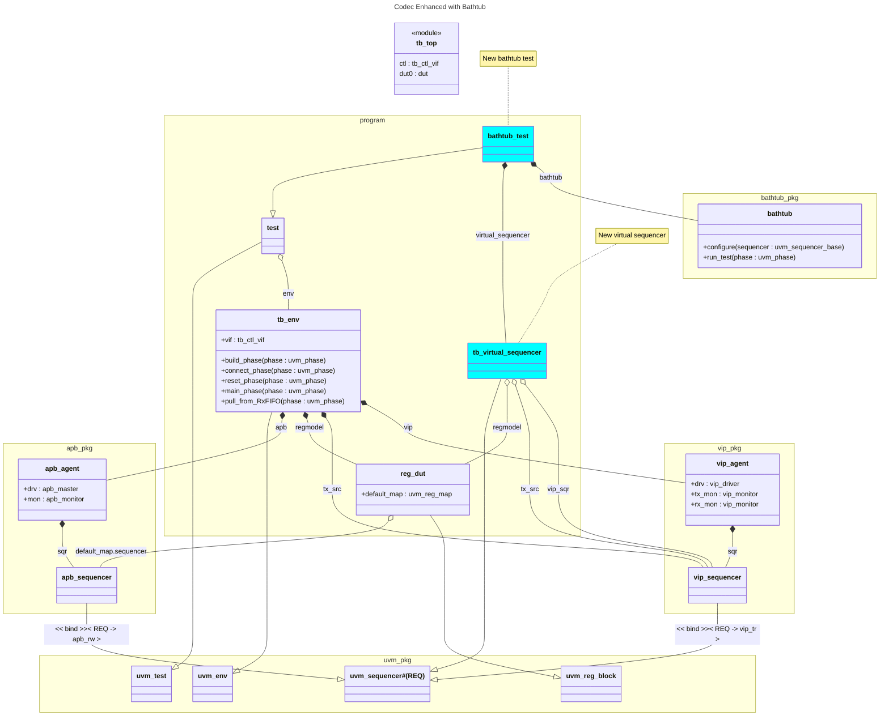
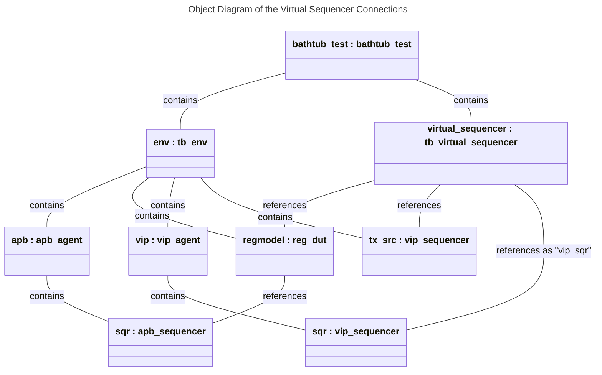
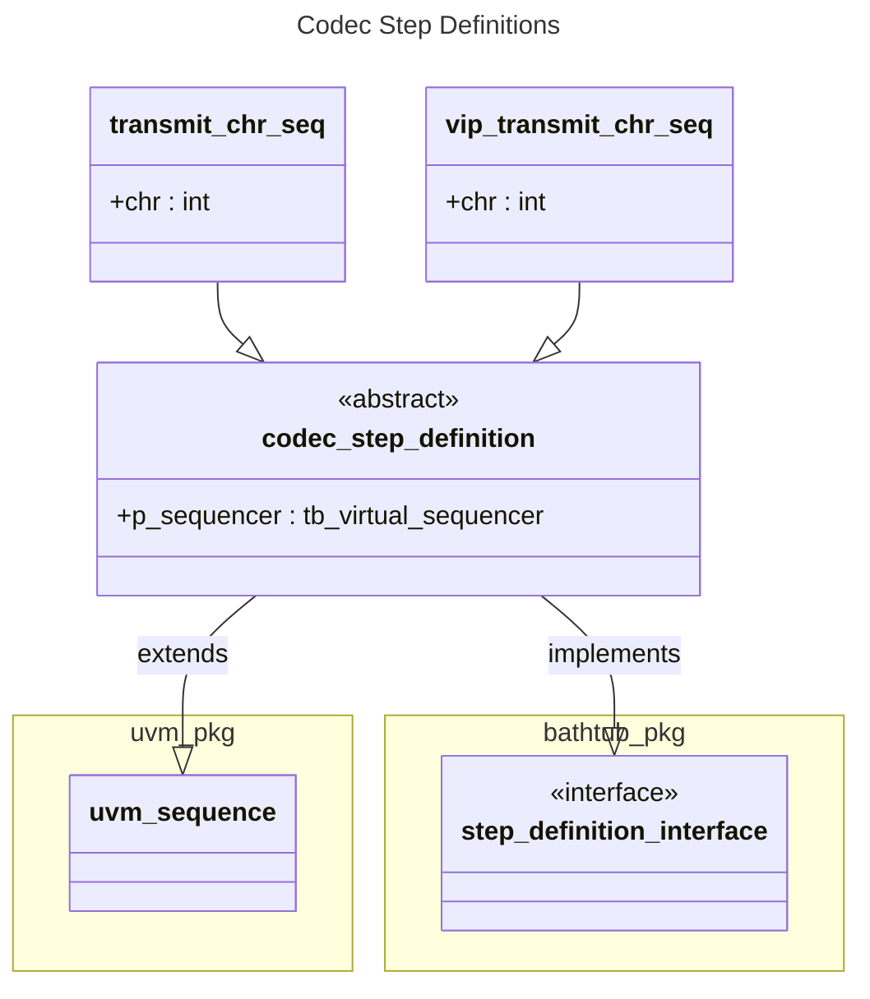

# codec
The reference implementation libraries for UVM 1.0, 1.1, and 1.2 include complete source code for a working verification environment for a simple parallel-to-serial codec.
We are going to apply Bathtub to that codec environment.
The purpose is to illustrate how you can apply Bathtub to any UVM testbench.
## Overview
In general, these are the steps for applying Bathtub to a UVM testbench.
1. Build a working UVM environment.
   * It should follow standard practices and include a top module, DUT, environment (`uvm_env`), and virtual sequencer.
   * You should have the simulators, scripts, and support files required to run the environment.
2. Create a new Bathtub test (`uvm_test`).
   * Instantiate a Bathtub object (`bathtub_pkg::bathtub`) and configure it with your virtual sequencer.
   * Since Bathtub will provide sequences for some of your sequencers, the test should disable any default sequences for run-time phases that might conflict.
3. Write a Gherkin feature file that describes and exercises the behavior of the DUT.
4. Write step definitions (`uvm_sequence`) for every step in the feature file.
5. Run Bathtub!

This README walks through the above steps for the codec example.
## Build a UVM Environment
Fortunately this has already been done for you.
Download the UVM 1.2 reference implementation class library code ([uvm-1.2.tar.gz](https://accellera.org/images/downloads/standards/uvm/uvm-1.2.tar.gz)) from Accellera's UVM download page, <https://accellera.org/downloads/standards/uvm>.

Often UVM is installed in a central, shared location protected by restricted permissions.
However, for this codec example, you need your own personal UVM installation with full read and write access permissions.
The UVM 1.2 `README.txt` has instructions for installing the kit.
Follow them to unpack the tarball into a "convenient location," perhaps somewhere under your home directory.
```
Installing the kit
------------------

Installation of UVM requires first unpacking the kit in a convenient
location.

    % mkdir path/to/convenient/location
    % cd path/to/convenient/location
    % gunzip -c path/to/UVM/distribution/tar.gz | tar xvf -
```
It is not necessary to set or override the `UVM_HOME` environment variable; the codec scripts take care of that for you.
It doesn't matter if you typically use a UVM version other than 1.2.
The codec example is self-contained and will compile UVM directly from your personal 1.2 installation.

Alternatively, if you already have UVM 1.2 installed somewhere on your file system, you don't need to download it again. You can just copy the entire directory to your personal convenient location with `cp -r`.

You'll be bouncing around a few different directories, so let's give them pseudo variable names to make this discussion easier.
| Name | Description |
| --- | --- |
| `USER_UVM_HOME` | Path to your personal UVM installation. |
| `CODEC_WORKING_DIR` | Path to your codec example. This is your working directory. `CODEC_WORKING_DIR=$USER_UVM_HOME/examples/integrated/codec` |
| `BATHTUB_VIP_DIR` | Path to your Bathtub installation directory. This should be an actual environment variable. |
| `BATHTUB_CODEC_SRC` | Path to the Bathtub codec example source, i.e., the directory containing this `README.md` file. You will copy files from `$BATHTUB_CODEC_SRC` to `$CODEC_WORKING_DIR`. `BATHTUB_CODEC_SRC=$BATHTUB_VIP_DIR/examples/uvm_examples/codec` |

Change to your working directory (`cd $CODEC_WORKING_DIR`) and try to run the codec example as-is.
The directory contains makefiles for the Big Three simulators: Incisive (`ius`), Questa, and VCS.
If you're unfamiliar with makefiles, you can learn about them at <https://www.gnu.org/software/make/>.
Choose your preferred simulator and try running with the corresponding makefile.
| Simulator | Command |
| --- | --- |
| Incisive | `make -f Makefile.ius test` |
| Questa | `make -f Makefile.questa run` # Note that the target is `run`, not `test` like the others. |
| VCS | `make -f Makefile.vcs test` |

Do whatever you need to do to get your simulation to run and pass on your system.
If you look inside the makefiles, you'll see that they each include a corresponding makefile two directories higher (`include ../../Makefile.xxx`), in `$USER_UVM_HOME/examples`.
You may need to set up your environment, or edit included makefiles two directories up.
(They're your personal makefiles, so edit them as much as you like. You might want to make backup copies first.)

Cadence replaced Incisive with Xcelium, but it seems that the Incisive `irun` commands still work. 

⚠️ **Note:** Cadence simulators (`irun` and `xrun`) generally require the `-uvmnocdnsextra` command line option since we are not using Cadence's built-in UVM library.
You can make that change in `$CODEC_WORKING_DIR/../../Makefile.ius`, e.g.:
```
# Change
IUS =   irun -access rw -uvmhome $(UVM_HOME) +UVM_VERBOSITY=$(UVM_VERBOSITY) -quiet
# to
IUS =   irun -access rw -uvmhome $(UVM_HOME) +UVM_VERBOSITY=$(UVM_VERBOSITY) -quiet -uvmnocdnsextra
```
⚠️ **Note:** Newer versions of Questa have deprecated `+acc` option `m`, so you should remove it from the makefile.
Edit `$CODEC_WORKING_DIR/../../Makefile.questa`:
```
# Change
        +acc=rmb \
# to
        +acc=rb \
```
You can find our modified versions of the makefiles in the Bathtub examples source directory, each with "inc" in the name.
These files work for us, but you might need to make additional modifications.
```
$BATHTUB_CODEC_SRC/Makefile_inc.ius
$BATHTUB_CODEC_SRC/Makefile_inc.questa
$BATHTUB_CODEC_SRC/Makefile_inc.vcs
```

The simulators produce various log files and other artifacts in your working directory.
The included makefiles all have `clean` targets you can use to remove those files.

| Simulator | Command |
| --- | --- |
| Incisive | `make -f Makefile.ius clean` |
| Questa | `make -f Makefile.questa clean` |
| VCS | `make -f Makefile.vcs clean` |

Once your simulation is running and passing, you're ready to move on.

## Create a New Bathtub Test
You got the codec testbench running as-is.
Now we're going to modify it.

`$CODEC_WORKING_DIR/README.txt` briefly describes the DUT, and `$CODEC_WORKING_DIR/block_diagram.pdf` gives an overview of the testbench.
Here's a UML class diagram of the testbench that focuses on the parts relevant to this Bathtub exercise.


The testbench has a `uvm_test` class called `test` which is our top component.
We're going to extend it into a new class called `bathtub_test`.
The existing `test` class is defined in file `$CODEC_WORKING_DIR/test.sv`.
That file `` `include``s a file called `$CODEC_WORKING_DIR/testlib.svh`, which is a library of additional tests.
We'll add our new test to `testlib.svh`.
You can find our new Bathtub test in `$BATHTUB_CODEC_SRC/bathtub_test.svh`.
You can also find in `$BATHTUB_CODEC_SRC` a modified version of `testlib.svh` which`` `include``s our Bathtub test.
All you need to do is copy `bathtub_test.svh` and a `testlib.svh` from `$BATHTUB_CODEC_SRC` into `$CODEC_WORKING_DIR`.
`bathtub_test.svh` is new to `$CODEC_WORKING_DIR`, but `testlib.svh` will overwrite the existing version so you should make a backup first.
```
# Copy two files from the Bathtub examples directory into your working directory
cp $CODEC_WORKING_DIR/testlib.svh $CODEC_WORKING_DIR/testlib.svh-BACKUP # Make a backup first
cp $BATHTUB_CODEC_SRC/bathtub_test.svh $BATHTUB_CODEC_SRC/testlib.svh $CODEC_WORKING_DIR
```
### Remove Default Sequences
The codec example `tb_env` class has main phase default sequences hard-coded for two of its sequencers.
```sv
      uvm_config_db #(uvm_object_wrapper)::set(this, "vip.sqr.main_phase",
                                               "default_sequence",
                                               vip_sentence_seq::type_id::get());
      uvm_config_db #(uvm_object_wrapper)::set(this, "tx_src.main_phase",
                                               "default_sequence",
                                               vip_sentence_seq::type_id::get());
```
Our Bathtub test needs to override those default sequence selections because Bathtub will be supplying sequences to those sequencers itself.
The _UVM 1.2 Class Reference_ warns in the "`uvm_sequencer_base::start_phase_sequence`" section that we must override default sequences in the resource database two ways:
> When attempting to override a
previous default sequence setting, you must override both the instance and type
(wrapper) resources, else your override may not take effect.

The Bathtub test does exactly that, for both sequencers, setting the default sequence resources to null:
```sv
    function void build_phase(uvm_phase phase);
        uvm_sequence_base default_sequence;
        uvm_object_wrapper default_sequence_type;

        // Empty sequences
        default_sequence = null;
        default_sequence_type = null;

        ...

        // Override default sequences set in the tb environment class.
        uvm_config_db#(uvm_object_wrapper)::set(null, "env.vip.sqr.main_phase",
                                                "default_sequence",
                                                default_sequence_type);
        uvm_config_db#(uvm_object_wrapper)::set(null, "env.tx_src.main_phase",
                                                "default_sequence",
                                                default_sequence_type);
        uvm_config_db#(uvm_sequence_base)::set(null, "env.vip.sqr.main_phase",
                                                "default_sequence",
                                                default_sequence);
        uvm_config_db#(uvm_sequence_base)::set(null, "env.tx_src.main_phase",
                                                "default_sequence",
                                                default_sequence);
    endfunction : build_phase
```
### Add a Virtual Sequencer
The original codec testbench instantiates three "concrete" sequencers:
1. `test.env.tx_src : vip_sequencer` -- Provides `vip_tr` sequence items containing data bytes that the testbench's main routine writes into the DUT's `TxFIFO` to be transmitted.
2. `test.env.vip.sqr : vip_sequencer` -- Provides `vip_tr` sequence items containing data bytes that the testbench's VIP driver transmits into the DUT's serial `rx` input.
3. `test.env.apb.sqr : apb_sequencer` -- Receives register accesses from the register model in the form of `apb_rw` sequence items and executes them on the DUT's APB interface.

Unfortunately the testbench does not contain a virtual sequencer to tie them all together.
This omission simplifies the testbench, but it precludes any virtual sequences that might combine the three concrete sequencers in interesting ways, such as looping back transmitted data.
We want Bathtub to have the benefit of a virtual sequencer, so we enhance the codec testbench by adding one.

Copy the virtual sequencer file from the Bathtub examples source directory to your working directory.
```
cp $BATHTUB_CODEC_SRC/tb_virtual_sequencer.svh $CODEC_WORKING_DIR
```
The Bathtub test already instantiates the virtual sequencer and connects it to the concrete sequencers.
Note that it is normally best practice to instantiate the virtual sequencer inside the environment class, not the test class, but for the sake of this exercise it is simpler to put it in the test class so we don't have to touch `tb_env.svh`.

This updated UVM diagram shows the testbench with the Bathtub test and virtual sequencer added.


This UML object diagram shows how the `tb_env` component instantiates all the concrete sequencers as children or grandchildren, and the virtual sequencer simply references them all.
The register model has a reference to the APB sequencer and provides a useful UVM register-based interface to it, so the virtual sequencer contains a reference to the register model instead of the APB sequencer directly.

You can confirm that your Bathtub-updated testbench still works by running the original unchanged `test` on it.
First we must update the makefiles since we have added some new files to the working directory.
Recall that each simulator requires two makefiles, which we call the "run" makefile (`Makefile_run.xxx`) and the "include" makefile (`Makefile_inc.xxx`).
You will now copy the "run" makefiles from the Bathtub examples source directory to the your directory.
Make backup copies of your original makefiles before you copy over them.
```
# Back up your makefiles.
cp $CODEC_WORKING_DIR/Makefile.ius $CODEC_WORKING_DIR/Makefile.ius-BACKUP
cp $CODEC_WORKING_DIR/Makefile.questa $CODEC_WORKING_DIR/Makefile.questa-BACKUP
cp $CODEC_WORKING_DIR/Makefile.vcs $CODEC_WORKING_DIR/Makefile.vcs-BACKUP

# Copy our makefiles from the Bathtub examples source directory to your working directory.
# Note that the source and destination filenames are different.
cp $BATHTUB_CODEC_SRC/Makefile_run.ius $CODEC_WORKING_DIR/Makefile.ius
cp $BATHTUB_CODEC_SRC/Makefile_run.questa $CODEC_WORKING_DIR/Makefile.questa
cp $BATHTUB_CODEC_SRC/Makefile_run.vcs $CODEC_WORKING_DIR/Makefile.vcs
```
The new makefiles have a new target for running the original `test` on your updated testbench:
| Simulator | Command |
| --- | --- |
| Incisive | `make -f Makefile.xcelium test_with_bathtub` |
| Questa | `make -f Makefile.questa test_with_bathtub` |
| VCS | `make -f Makefile.vcs test_with_bathtub` |
## Write a Gherkin Feature File
We have done this for you.
Copy the feature file from the Bathtub examples source directory to your working directory.
```
cp $BATHTUB_CODEC_SRC/codec.feature $CODEC_WORKING_DIR
```
It's a very small, simple feature file, just enough to demonstrate that Bathtub is working.
## Write Step Definitions
Again, we have provided these.
Copy the step definition file from the Bathtub examples source directory to your working directory.
```
cp $BATHTUB_CODEC_SRC/codec_step_definitions.svh $CODEC_WORKING_DIR
```
There is an abstract base class for the step definitions and two child classes: one to transmit a single byte from parallel (APB) to serial, and one to transmit a single byte from the serial VIP agent to the DUT's `rx` pin.
These step definitions are sufficient to cover our simple feature file.
A more thorough feature file would require many more step definition classes.
This class diagram depicts the step definition sequences.


The base class declares a `p_sequencer` that references the virtual sequencer through which the child step definitions can access the concrete sequencers.
Each sequencer has an integer `chr` member which holds the data byte parameters in the feature file.
## Run Bathtub
The  makefiles have a `bathtub_test` target for running the Bathtub test.
The simulator command line includes options `+UVM_TESTNAME=bathtub_test +bathtub_features=codec.feature`, which specify the test and feature file.
| Simulator | Command |
| --- | --- |
| Incisive | `make -f Makefile.xcelium bathtub_test` |
| Questa | `make -f Makefile.questa bathtub_test` |
| VCS | `make -f Makefile.vcs bathtub_test` |

Try running it.
Hopefully it passes.
Congratulations, you have run the codec example with Bathtub!
## Automated Version
The script `run_me.sh` in this directory performs the steps in this `README`.
From the script's Usage section:
> This script automatically runs through the process of applying Bathtub to the UVM 1.2 codec example.
It downloads your own personal UVM 1.2 installation, gets it running as-is, adds Bathtub by copying files from this directory, then runs everything all together.
You may need to customize this script for your environment.
See `README.md` for details.
This script is intended to be living documentation that is operational but also human-readable, so you can understand the steps involved.
> 
> The script requires you have environment variable $BATHTUB_VIP_DIR which contains the path to your Bathtub installation.
Run this script from a suitable directory that you have read and write privileges for, e.g., your home directory:
```
sh -f $BATHTUB_VIP_DIR/examples/uvm_examples/codec/run_me.sh
```
## Congratulations
You have a working UVM codec example testbench with Bathtub!
Feel free to examine the files to see how the Bathtub pieces fit together.
Then you can experiment with modifying the feature file and adding more step definitions.
Finally, apply Bathtub to your own project and testbench.
Good luck!
